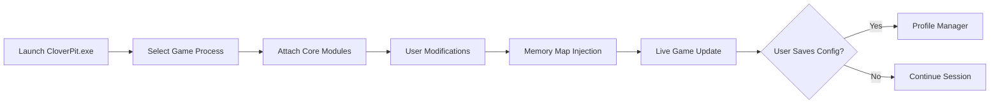

# CloverPit Mod Menu 🌿

The **CloverPit Mod Menu** is a next-generation customization framework built to give players full authority over their gaming environment. It fuses accessibility, creative freedom, and technical precision into a single streamlined interface — letting you modify, monitor, and fine-tune gameplay parameters live.

Whether you’re tweaking performance values, visual filters, or gameplay mechanics, CloverPit delivers a smooth and user-friendly configuration experience.

---

## 🌐 Overview

Unlike ordinary tweak menus, **CloverPit** uses modular injection and sandbox-safe architecture. It applies changes **in real time** without requiring restarts or patching core files.

With intuitive sliders, toggles, and live preview overlays, players can experiment safely and instantly — ideal for streamers, speedrunners, and mod developers alike.

---

## ⚙️ Features

| Module                  | Description                                                           |
| ----------------------- | --------------------------------------------------------------------- |
| **Visual Suite**        | Toggle bloom, shadows, weather, and post-processing filters live.     |
| **Performance Manager** | Modify CPU/GPU caps, frame limiters, and memory allocation safely.    |
| **Unlock Hub**          | Instantly enable all available in-game items, cosmetics, and regions. |
| **UI Customizer**       | Resize HUD, reposition menus, and recolor interface elements.         |
| **Physics Control**     | Adjust gravity, collision scaling, and object weight multipliers.     |
| **Profile Manager**     | Save, export, and import complete configuration presets.              |

[!NOTE]
Each CloverPit module runs independently, allowing you to enable or disable systems without reloading the base engine.

---

## 🧩 Compatibility

| Platform               | Supported | Details                               |
| ---------------------- | --------- | ------------------------------------- |
| **Windows 10**         | ✅         | Stable across DirectX 11 & 12         |
| **Windows 11**         | ✅         | Auto-adjusts for dynamic refresh rate |
| **Steam Version**      | ✅         | Direct attach via API injection       |
| **Epic Games Version** | ⚙️        | Manual path selection required        |
| **Controller Input**   | ✅         | Full support via DirectInput bridge   |

[!IMPORTANT]
Always run **CloverPit.exe** as Administrator to allow correct driver-level read/write access for configuration updates.

---

## ⚡️ Setup Guide

**Step 1:** Download the CloverPit Mod Menu ZIP package.
**Step 2:** Extract contents to your desktop (avoid Program Files).
**Step 3:** Open `CloverPit.exe` → click “Attach to Process”.
**Step 4:** Configure basic parameters in the startup panel:

```ini
[Visual]
Bloom = Off
MotionBlur = Low
HUDOpacity = 0.75

[Performance]
TargetFPS = 144
CPUThreads = 8
VSync = Off
```

**Step 5:** Press `F8` in-game to toggle the CloverPit interface.

---

## 🧠 System Flow



---

## 💬 FAQ

**Q1: Does CloverPit modify original game files?**
🔹 No, it runs externally — all changes are session-based and reversible.

**Q2: Can I use multiple mods with CloverPit?**
🔹 Yes, modules are designed to be stackable with other third-party visual mods.

**Q3: How are updates handled?**
🔹 The launcher auto-checks for compatibility patches and downloads updates in the background.

**Q4: Can I export my settings?**
🔹 Absolutely — your entire mod layout can be saved as a `.clvprofile` file.

**Q5: Is it optimized for high refresh rates?**
🔹 Yes, CloverPit dynamically syncs overlays and sliders up to 240Hz.

---

## 🧭 Tips & Best Practices

* Enable “Safe Mode” before loading experimental physics modules.
* Use the “Visual Preview” tab to verify shader changes before applying.
* Keep your profiles backed up — perfect for switching between casual and benchmark configurations.

[!WARNING]
Using high experimental parameters (e.g., physics scaling above 3.0x) can cause instability or unexpected object behavior.

---

## 🌱 Final Thoughts

The **CloverPit Mod Menu** stands out as a powerful, secure, and highly customizable configuration suite for PC users who love experimentation and visual tuning. With its modular design and intuitive interface, it’s the perfect companion for modders, creators, and players seeking full control.

